# Template Examples

This document showcases the example poster template styles for the Episode Poster Generator plugin.

---

## Cutout

**Template:** [File](Examples/Cutout/Template.json)

| Example 1 | Example 2 | Example 3 | Example 4 | Example 5 |
|-----------|-----------|-----------|-----------|-----------|
| 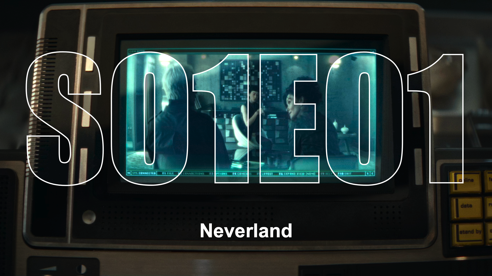 | 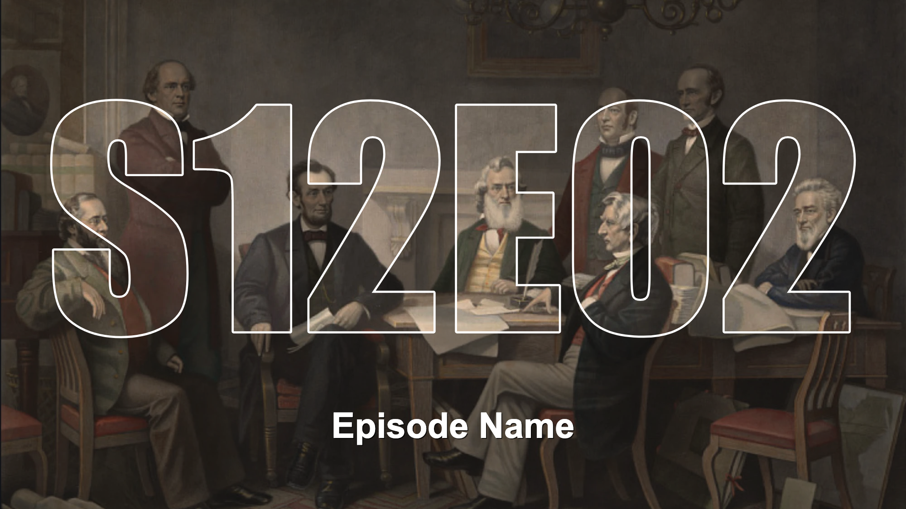 |  | 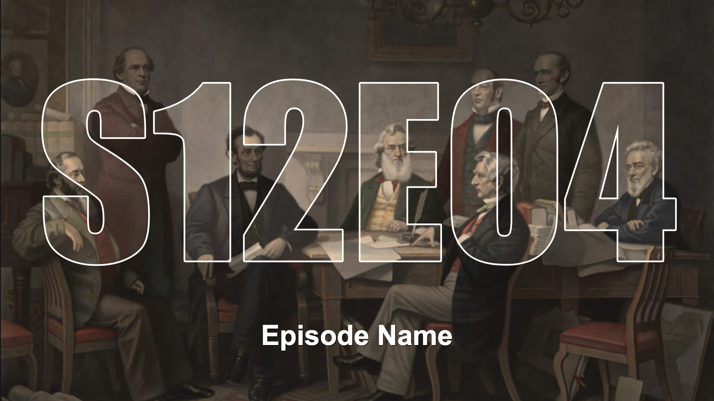 | 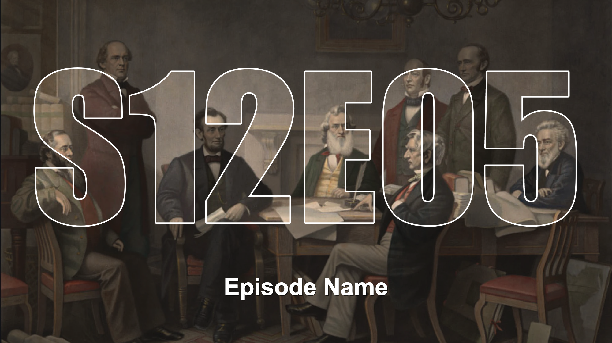 |

| Example 6 | Example 7 | Example 8 | Example 9 | Example 10 |
|-----------|-----------|-----------|-----------|------------|
| 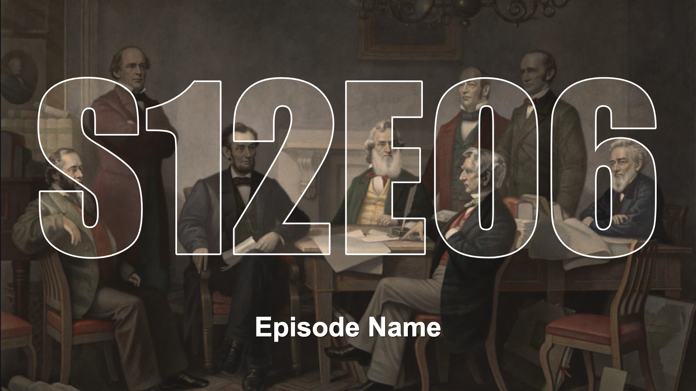 | 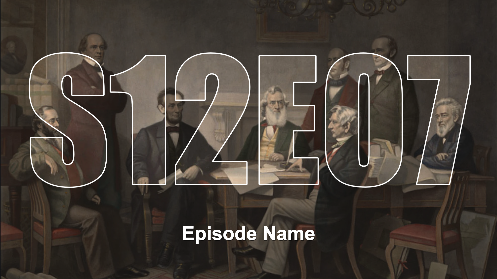 |  | 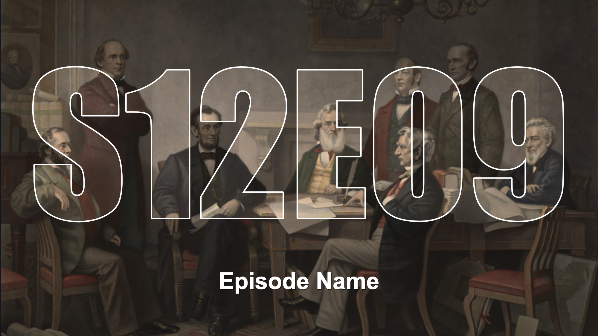 |  |

---

## Cutout Gradient

**Template:** [File](Examples/CutoutGradient/Template.json)

| Example 1 | Example 2 | Example 3 | Example 4 | Example 5 |
|-----------|-----------|-----------|-----------|-----------|
|  |  |  |  |  |

| Example 6 | Example 7 | Example 8 | Example 9 | Example 10 |
|-----------|-----------|-----------|-----------|------------|
|  |  |  |  |  |

---

## Frame

**Template:** [File](Examples/Frame/Template.json)

| Example 1 | Example 2 | Example 3 | Example 4 | Example 5 |
|-----------|-----------|-----------|-----------|-----------|
|  | 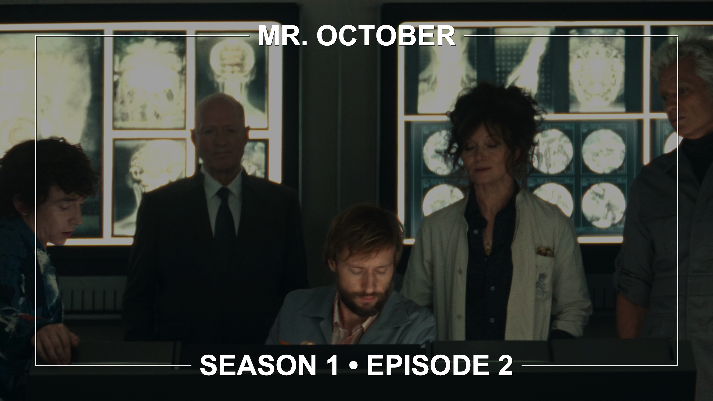 |  | 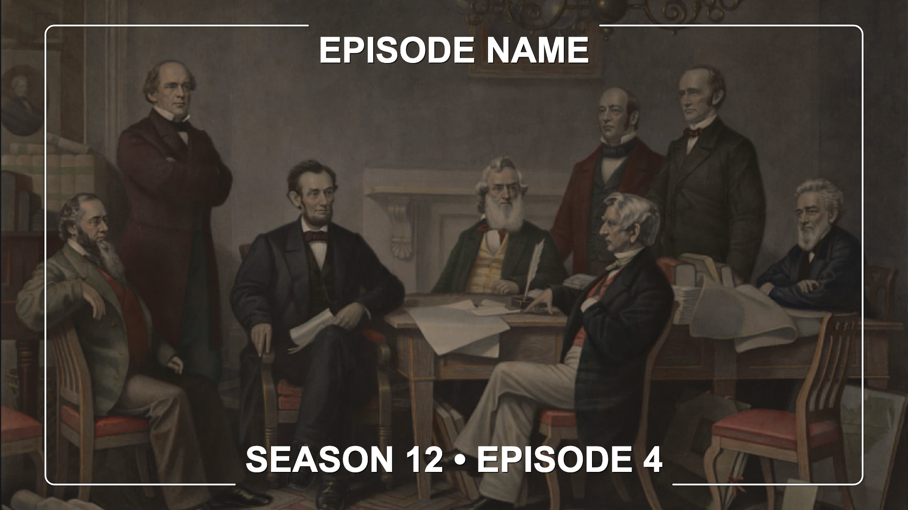 |  |

| Example 6 | Example 7 | Example 8 | Example 9 | Example 10 |
|-----------|-----------|-----------|-----------|------------|
|  |  |  |  |  |

---

## Partial Frame

**Template:** [File](Examples/PartialFrame/Template.json)

| Example 1 | Example 2 | Example 3 | Example 4 | Example 5 |
|-----------|-----------|-----------|-----------|-----------|
|  |  |  |  |  |

| Example 6 | Example 7 | Example 8 | Example 9 | Example 10 |
|-----------|-----------|-----------|-----------|------------|
|  |  |  |  |  |

---

## Logo

**Template:** [File](Examples/Logo/Template.json)

| Example 1 | Example 2 | Example 3 | Example 4 | Example 5 |
|-----------|-----------|-----------|-----------|-----------|
|  |  |  |  |  |

| Example 6 | Example 7 | Example 8 | Example 9 | Example 10 |
|-----------|-----------|-----------|-----------|------------|
|  |  |  |  |  |

---

## Logo Compact

**Template:** [File](Examples/LogoCompact/Template.json)

| Example 1 | Example 2 | Example 3 | Example 4 | Example 5 |
|-----------|-----------|-----------|-----------|-----------|
|  |  |  |  |  |

| Example 6 | Example 7 | Example 8 | Example 9 | Example 10 |
|-----------|-----------|-----------|-----------|------------|
|  |  |  |  |  |

---

## Logo Gradient

**Template:** [File](Examples/LogoGradient/Template.json)

| Example 1 | Example 2 | Example 3 | Example 4 | Example 5 |
|-----------|-----------|-----------|-----------|-----------|
| 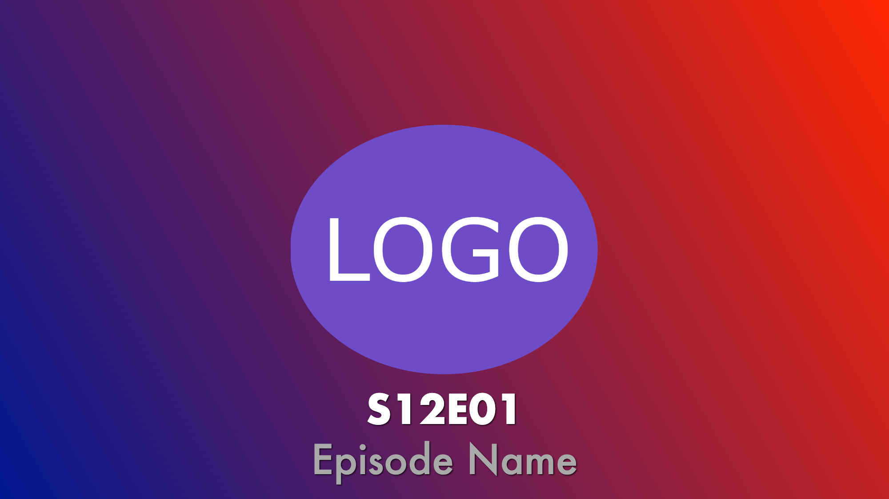 | 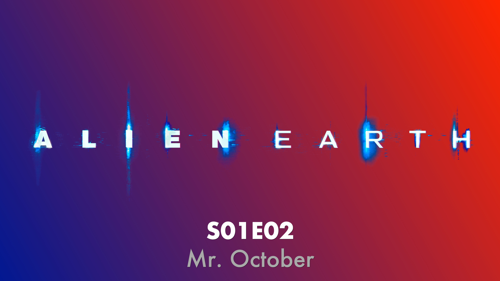 | 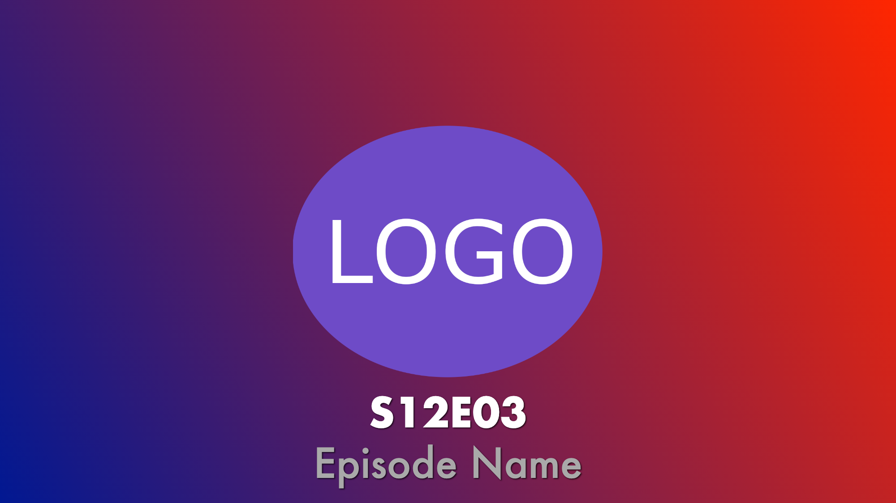 |  |  |

| Example 6 | Example 7 | Example 8 | Example 9 | Example 10 |
|-----------|-----------|-----------|-----------|------------|
|  | 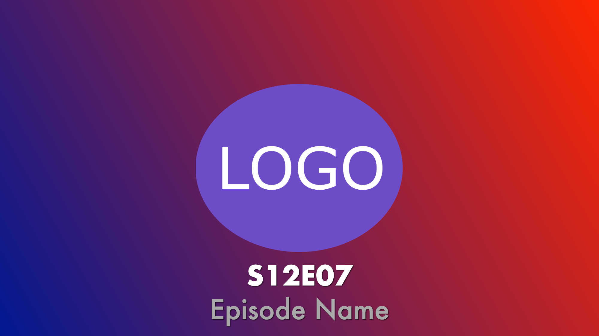 | 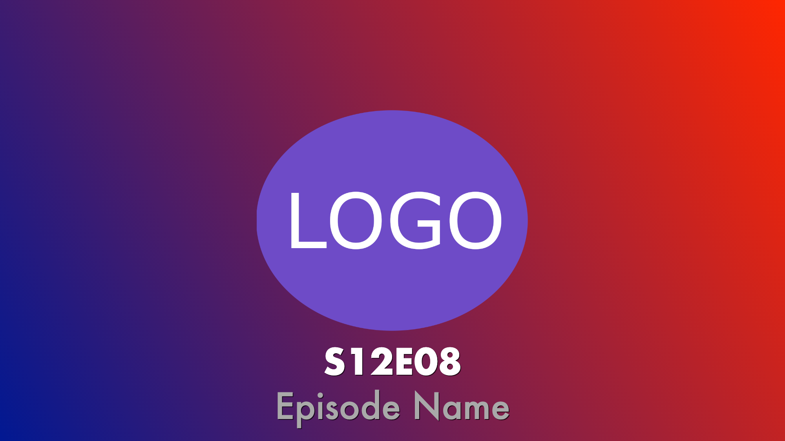 | 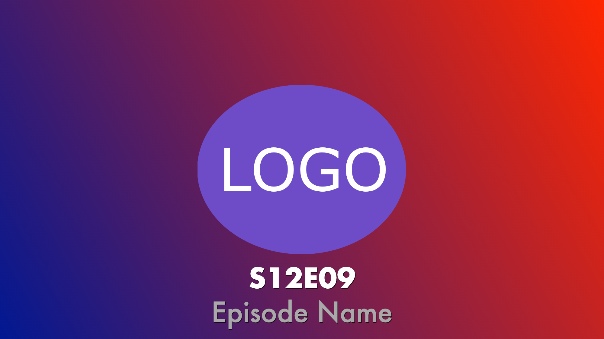 | 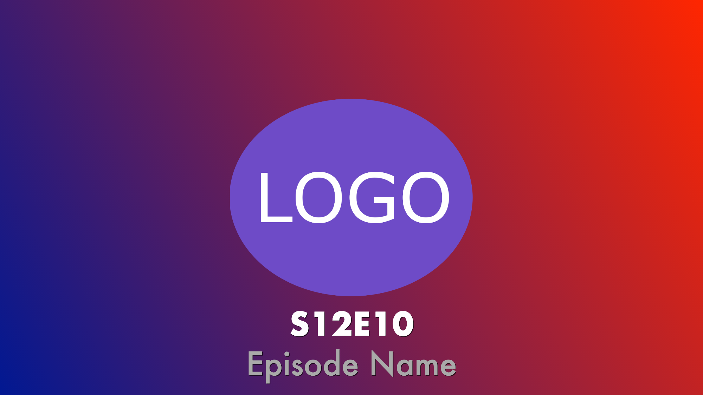 |

---

## Numeral

**Template:** [File](Examples/Numeral/Template.json)

| Example 1 | Example 2 | Example 3 | Example 4 | Example 5 |
|-----------|-----------|-----------|-----------|-----------|
|  |  |  |  |  |

| Example 6 | Example 7 | Example 8 | Example 9 | Example 10 |
|-----------|-----------|-----------|-----------|------------|
|  |  |  |  |  |

---

## Numeral Full

**Template:** [File](Examples/NumeralFull/Template.json)

| Example 1 | Example 2 | Example 3 | Example 4 | Example 5 |
|-----------|-----------|-----------|-----------|-----------|
|  |  |  |  |  |

| Example 6 | Example 7 | Example 8 | Example 9 | Example 10 |
|-----------|-----------|-----------|-----------|------------|
|  |  |  |  |  |

---

## Plain

**Template:** [File](Examples/Plain/Template.json)

| Example 1 | Example 2 | Example 3 | Example 4 | Example 5 |
|-----------|-----------|-----------|-----------|-----------|
|  |  |  |  |  |

| Example 6 | Example 7 | Example 8 | Example 9 | Example 10 |
|-----------|-----------|-----------|-----------|------------|
|  |  |  |  |  |

---

## Simple

**Template:** [File](Examples/Simple/Template.json)

| Example 1 | Example 2 | Example 3 | Example 4 | Example 5 |
|-----------|-----------|-----------|-----------|-----------|
|  |  |  |  |  |

| Example 6 | Example 7 | Example 8 | Example 9 | Example 10 |
|-----------|-----------|-----------|-----------|------------|
|  |  |  |  |  |

---

## Standard

**Template:** [File](Examples/Standard/Template.json)

| Example 1 | Example 2 | Example 3 | Example 4 | Example 5 |
|-----------|-----------|-----------|-----------|-----------|
|  |  |  |  |  |

| Example 6 | Example 7 | Example 8 | Example 9 | Example 10 |
|-----------|-----------|-----------|-----------|------------|
|  |  |  | 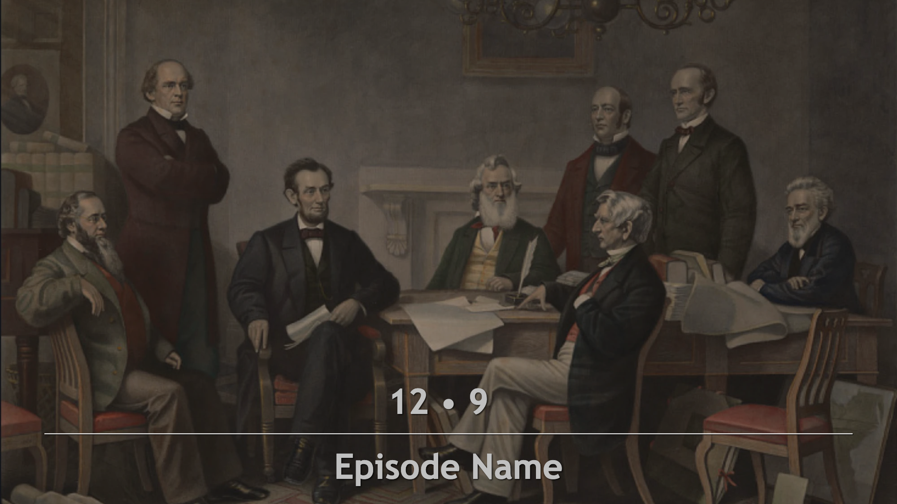 |  |

---

## Standard Gradient

**Template:** [File](Examples/StandardGradient/Template.json)

| Example 1 | Example 2 | Example 3 | Example 4 | Example 5 |
|-----------|-----------|-----------|-----------|-----------|
|  |  |  |  |  |

| Example 6 | Example 7 | Example 8 | Example 9 | Example 10 |
|-----------|-----------|-----------|-----------|------------|
|  |  |  |  |  |

---

## Standard Brush

**Template:** [File](Examples/StandardBrush/Template.json)

| Example 1 | Example 2 | Example 3 | Example 4 | Example 5 |
|-----------|-----------|-----------|-----------|-----------|
|  |  |  |  |  |

| Example 6 | Example 7 | Example 8 | Example 9 | Example 10 |
|-----------|-----------|-----------|-----------|------------|
|  |  |  |  | 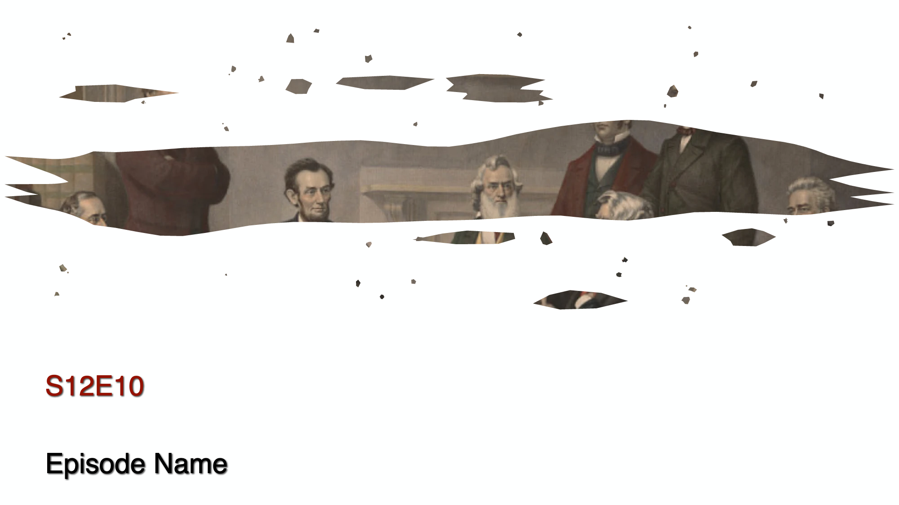 |

---

## Importing Templates

To use any of these templates:

1. Navigate to your Episode Poster Generator plugin configuration page
2. Click the **Import** button
3. Select the desired `Template.json` file
4. Enter a name for the configuration
5. Assign the template to specific series or use as default
