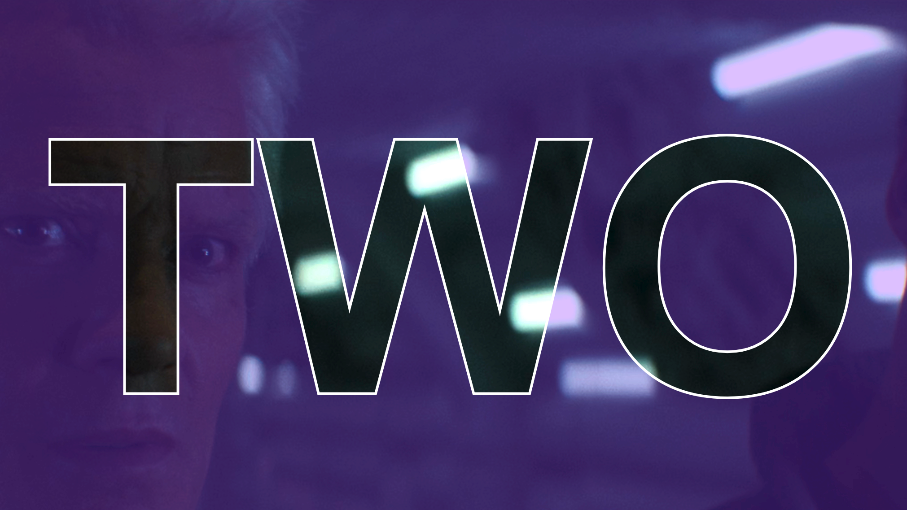
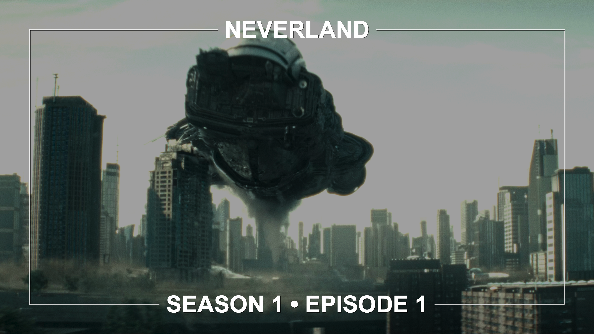
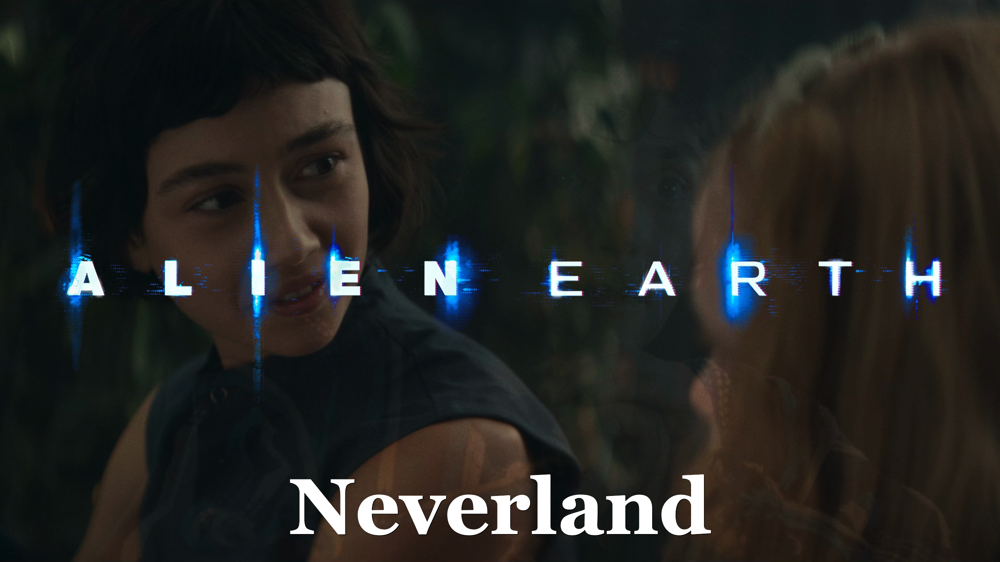
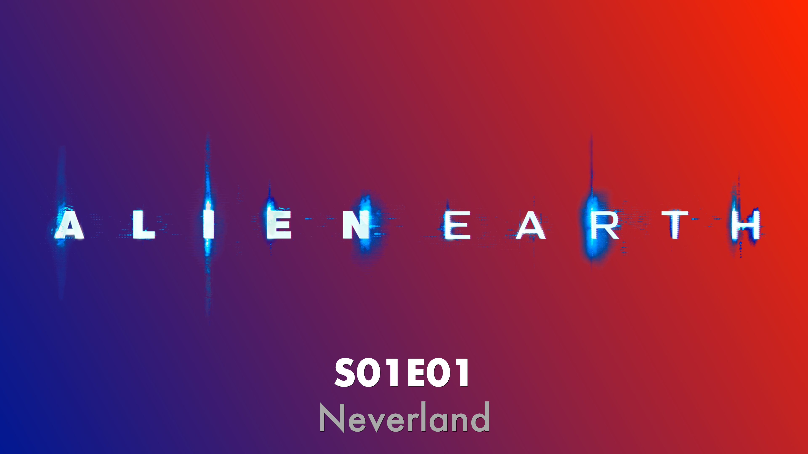
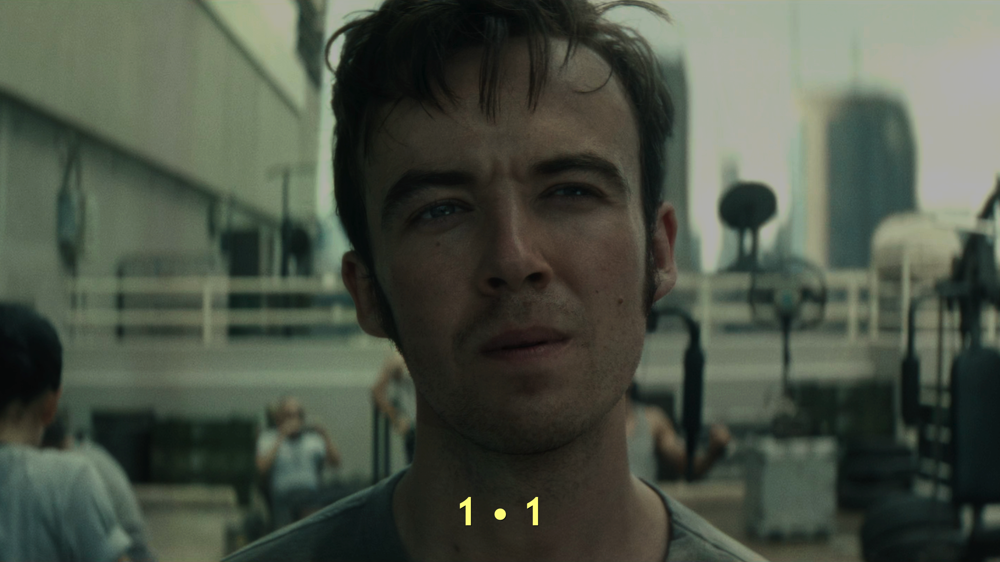

# Template Examples

This document showcases the available poster template styles for the Episode Poster Generator plugin.

---

## Cutout

**Template:** [File](Examples/Cutout/Template.json)

| Example 1 | Example 2 | Example 3 |
|-----------|-----------|-----------|
|  |  |  |

Bold cutout style with episode codes overlaid prominently on the poster image. Features Impact font for episode numbers and a semi-transparent black overlay for text legibility.

---

## Cutout Gradient

**Template:** [File](Examples/CutoutGradient/Template.json)

| Example 1 | Example 2 | Example 3 |
|-----------|-----------|-----------|
|  |  |  |

Cutout style enhanced with gradient overlays for additional visual depth and cinematic atmosphere.

---

## Frame

**Template:** [File](Examples/Frame/Template.json)

| Example 1 | Example 2 | Example 3 |
|-----------|-----------|-----------|
|  |  |  |

Clean, minimalist frame style that places episode information at the bottom of the poster with consistent framing.

---

## Logo

**Template:** [File](Examples/Logo/Template.json)

| Example 1 | Example 2 | Example 3 |
|-----------|-----------|-----------|
|  |  |  |

Incorporates the series logo (30% poster height) centered on the poster for strong brand recognition.

---

## Logo Compact

**Template:** [File](Examples/LogoCompact/Template.json)

| Example 1 | Example 2 | Example 3 |
|-----------|-----------|-----------|
|  |  |  |

Space-efficient logo style with a smaller logo footprint (15-20% height) allowing more focus on the episode image.

---

## Logo Gradient

**Template:** [File](Examples/LogoGradient/Template.json)

| Example 1 | Example 2 | Example 3 |
|-----------|-----------|-----------|
|  |  |  |

Logo branding combined with gradient overlays for a premium, cinematic look.

---

## Numeral

**Template:** [File](Examples/Numeral/Template.json)

| Example 1 | Example 2 | Example 3 |
|-----------|-----------|-----------|
|  |  |  |

Large episode numbers as the primary visual element with minimal overlay.

---

## Numeral Full

**Template:** [File](Examples/NumeralFull/Template.json)

| Example 1 | Example 2 | Example 3 |
|-----------|-----------|-----------|
|  |  |  |

Expanded numeral style featuring large episode numbers with complete episode metadata and title information.

---

## Plain

**Template:** [File](Examples/Plain/Template.json)

| Example 1 | Example 2 | Example 3 |
|-----------|-----------|-----------|
|  |  |  |

Minimal approach with very light overlay and clean text, preserving the original aspect ratio of the source image.

---

## Simple

**Template:** [File](Examples/Simple/Template.json)

| Example 1 | Example 2 | Example 3 |
|-----------|-----------|-----------|
|  |  |  |

Straightforward template with balanced text and image presentation, suitable for general purpose use.

---

## Standard

**Template:** [File](Examples/Standard/Template.json)

| Example 1 | Example 2 | Example 3 |
|-----------|-----------|-----------|
|  |  |  |

Default template with balanced settings, letterbox detection enabled, and WEBP format for optimized file size.

---

## Standard Gradient

**Template:** [File](Examples/StandardGradient/Template.json)

| Example 1 | Example 2 | Example 3 |
|-----------|-----------|-----------|
|  |  |  |

Enhanced standard template with customizable gradient overlay effects and blue accent gradient.

---

## Importing Templates

To use any of these templates:

1. Navigate to your Episode Poster Generator plugin configuration page
2. Click the **Import** button
3. Select the desired `Template.json` file
4. Enter a name for the configuration
5. Assign the template to specific series or use as default