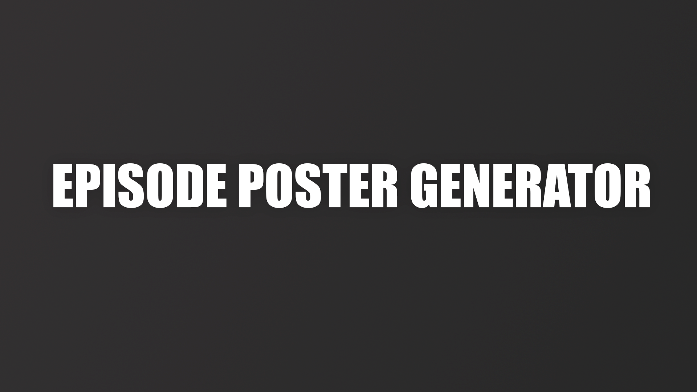

A Jellyfin plugin that automatically generates custom episode posters using smart frame analysis, black frame detection, letterbox detection, and configurable text styling. Perfect for filling in missing or generic episode artwork with clean, consistent visuals.

## Features

- **Automatic Frame Extraction**: Smart selection of representative frames from video files
- **Black Frame Detection**: Avoids extracting frames from black/transition scenes
- **Letterbox Detection**: Automatically detects and crops black letterbox/pillarbox borders from poster images
- **Multiple Poster Styles**: Choose from Standard, Cutout, Numeral, and Logo designs
- **Customizable Typography**: Full control over fonts, sizes, colors, and positioning
- **Flexible Layouts**: Support for various aspect ratios and fill strategies
- **Enhanced Logo Positioning**: Configurable logo alignment and positioning for Logo style posters
- **Cutout Text Borders**: Optional contrasting borders for improved cutout text visibility
- **Episode Information Display**: Show episode codes, titles, and season information

## Poster Styles

### Standard Style
Classic episode posters with overlay text and episode information.

| Example 1 | Example 2 |
|-----------|-----------|
|  |  |

**Features:**
- Episode screenshot as background
- Configurable text overlay with shadows
- Season and episode information
- Optional episode title display
- Customizable overlay tint

### Cutout Style  
Large episode numbers displayed as transparent cutouts revealing the screenshot beneath.

| Example 1 | Example 2 | Example 3 |
|-----------|-----------|-----------|
|  |  |  |

**Cutout Types:**
- **Code**: Displays episode in format "S01E03" 
- **Text**: Displays episode number as words (e.g., "THREE")

**Features:**
- Transparent text cutout effect
- Background color overlay
- Multi-line text support for longer episode codes
- Automatic font scaling
- Optional contrasting borders for improved visibility

### Numeral Style
Roman numeral episode numbers with elegant typography.

| Example 1 | Example 2 | Example 3 |
|-----------|-----------|-----------|
|  |  |  |

**Features:**
- Roman numeral conversion (1-3999)
- Large, centered numeral display
- Background color overlay
- Optional episode title

### Logo Style
Series logo-focused posters with episode information and clean typography.

| Example 1 | Example 2 | Example 3 |
|-----------|-----------|-----------|
|  |  |  |

**Features:**
- Series logo image as primary visual element
- Solid background color for clean appearance
- Configurable logo positioning (Top, Center, Bottom)
- Configurable logo alignment (Left, Center, Right)
- Adjustable logo height percentage (1-100%)
- Episode code display in S##E## format with proper zero-padding
- Text fallback when series logo image unavailable
- Optional episode title display
- Bottom-aligned text elements with consistent spacing
- Logo image respects safe area margins for optimal positioning

**Logo Sources:**
- **Primary**: Series logo image (when available)
- **Fallback**: Series primary image
- **Text Fallback**: Series name with optimized font scaling

## Installation

### Step 1: Add Plugin Repository

* Open Jellyfin and navigate to Dashboard → Plugins → Repositories
* Click Add Repository
* Enter the following repository URL: `https://raw.githubusercontent.com/JPKribs/jellyfin-plugin-episodepostergenerator/master/manifest.json`
* Click Save

### Step 2: Install Plugin

* Go to the Catalog tab in the Plugins section
* Find Episode Poster Generator in the catalog
* Click Install
* Wait for installation to complete

### Step 3: Restart Jellyfin

* Restart your Jellyfin server completely
* Wait for Jellyfin to fully start up

### Verification Check

* After restart, navigate to Dashboard → Plugins → Episode Poster Generator to confirm the plugin configuration page loads properly.
