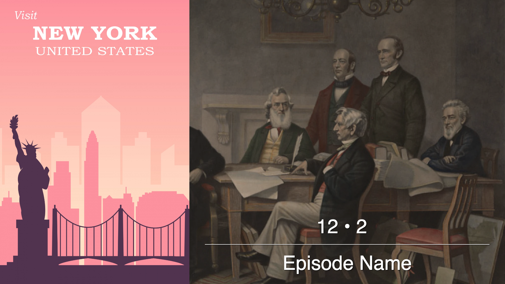

A Jellyfin plugin that automatically generates custom episode posters using smart frame analysis, black frame detection, letterbox detection, and configurable text styling. Perfect for filling in missing or generic episode artwork with clean, consistent visuals.

## Poster Styles

### Standard Style
Classic episode posters with overlay text and episode information.

| Example 1 | Example 2 | Example 3 |
|-----------|-----------|-----------|
|  |  |  |

### Brush Style  
Large episode numbers displayed as transparent cutouts revealing the screenshot beneath.

| Example 1 | Example 2 | Example 3 |
|-----------|-----------|-----------|
|  |  |  |

### Cutout Style  
Large episode numbers displayed as transparent cutouts revealing the screenshot beneath.

| Example 1 | Example 2 | Example 3 |
|-----------|-----------|-----------|
|  |  |  |

**Cutout Types:**
- **Code**: Displays episode in format "S01E03" 
- **Text**: Displays episode number as words (e.g., "THREE")

### Frame Style
Decorative frame borders with episode title and optional season/episode information.

| Example 1 | Example 2 | Example 3 |
|-----------|-----------|-----------|
|  |  |  |

### Logo Style
Series logo-focused posters with episode information and clean typography.

| Example 1 | Example 2 | Example 3 |
|-----------|-----------|-----------|
|  |  |  |

### Numeral Style
Roman numeral episode numbers with overlapping titles.

| Example 1 | Example 2 | Example 3 |
|-----------|-----------|-----------|
|  |  |  |

### Split Style
Classic episode posters with overlay text and episode information, split alongside the series poster.

| Example 1 | Example 2 | Example 3 |
|-----------|-----------|-----------|
|  |  |  |

## Poster Architecture

The Episode Poster Generator uses a 4-layer rendering pipeline to create consistent posters across all styles:

### Layer 1: Canvas (Base Layer)
The foundation layer that provides the visual background for the poster.

**Options:**
- **Video Frame Extraction**: Automatically extracts a representative frame from the episode video file using smart brightness detection and configurable extraction windows
- **Transparent Background**: Creates a solid color or transparent canvas when video extraction is disabled

**Processing:**
- HDR brightening for HDR content
- Letterbox/pillarbox detection and cropping
- Aspect ratio adjustments and fill strategies

### Layer 2: Overlay (Color Tinting)
A semi-transparent color layer applied over the canvas to enhance text readability and create visual cohesion.

**Features:**
- Configurable ARGB hex colors with alpha transparency
- Applied uniformly across the entire poster surface
- Essential for ensuring text remains readable against varying background images

### Layer 3: Graphics (Static Images)
Optional static graphic overlays positioned above the canvas but below text elements.

**Capabilities:**
- User-configurable file path for custom graphics
- Automatic sizing and positioning within safe area boundaries
- Supports PNG, JPG, and WEBP formats
- Maintains aspect ratio while fitting within poster constraints

### Layer 4: Typography (Text and Logos)
The top layer containing all text elements, episode information, and series logos.

**Elements:**
- Episode numbers and season information
- Episode titles with automatic text wrapping
- Series logos with configurable positioning
- Style-specific typography (Roman numerals, cutout text, etc.)
- Drop shadows and contrasting borders for enhanced readability

### Rendering Pipeline
Each poster style (Standard, Cutout, Numeral, Logo) follows this exact 4-layer sequence, ensuring consistent layouts. The modular approach allows for easy customization and additional poster styles.

## Template Examples & Downloads

For additional template examples and downloadable configurations, visit [EXAMPLES.md](EXAMPLES.md).

## Settings

[Explanation of settings can be found here!](SETTINGS.md)

## Installation

### Step 1: Add Plugin Repository

* Open Jellyfin and navigate to Dashboard → Plugins → Repositories
* Click Add Repository
* Enter the following repository URL: `https://raw.githubusercontent.com/JPKribs/jellyfin-plugin-episodepostergenerator/master/manifest.json`
* Click Save

### Step 2: Install Plugin

* Go to the Catalog tab in the Plugins section
* Find Episode Poster Generator in the catalog
* Click Install
* Wait for installation to complete

### Step 3: Restart Jellyfin

* Restart your Jellyfin server completely
* Wait for Jellyfin to fully start up

### Verification Check

* After restart, navigate to Dashboard → Plugins → Episode Poster Generator to confirm the plugin configuration page loads properly.