# 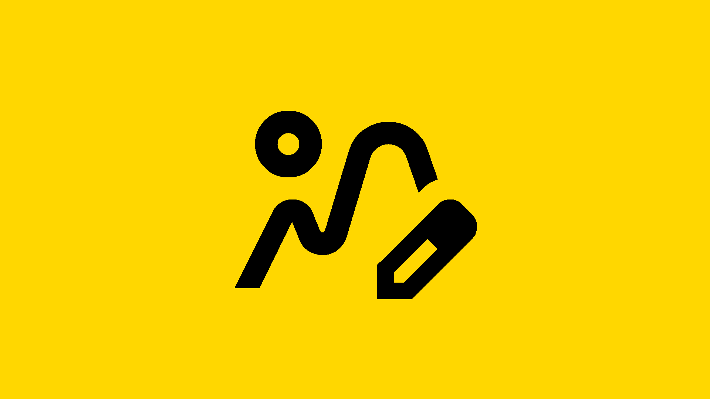

A Jellyfin plugin that automatically generates custom episode posters using smart frame analysis, black frame detection, letterbox detection, and configurable styling. Perfect for filling in missing or generic episode artwork with clean, consistent visuals.

## How It Works

Episode Poster Generator scans each episode file, evaluates multiple frames, and selects a strong candidate while avoiding fades, black screens, and letterboxed shots. The selected frame is turned into a poster and optionally styled with configurable text such as episode title or numbering.

Posters are uploaded directly into Jellyfin as a metadata provider.

## Poster Styles

### Standard Style
Simple screenshot with optional season/episode information.

| Example 1 | Example 2 | Example 3 |
|-----------|-----------|-----------|
|  | 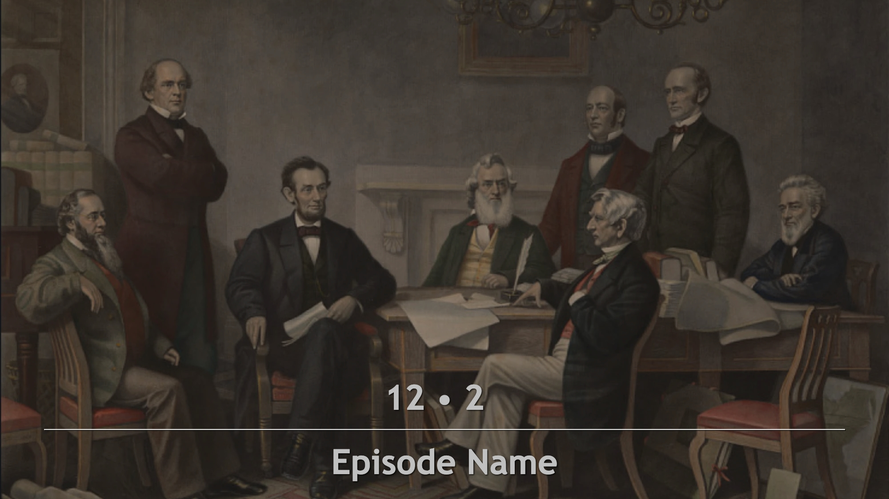 |  |

### Brush Style  
Flat color with a transparent brush cutout revealing the screenshot beneath, with optional season/episode information to the side.

| Example 1 | Example 2 | Example 3 |
|-----------|-----------|-----------|
| 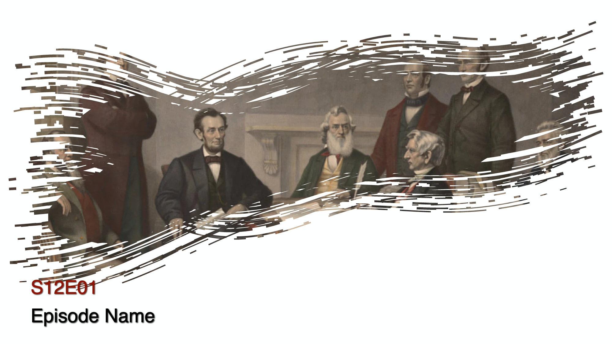 | 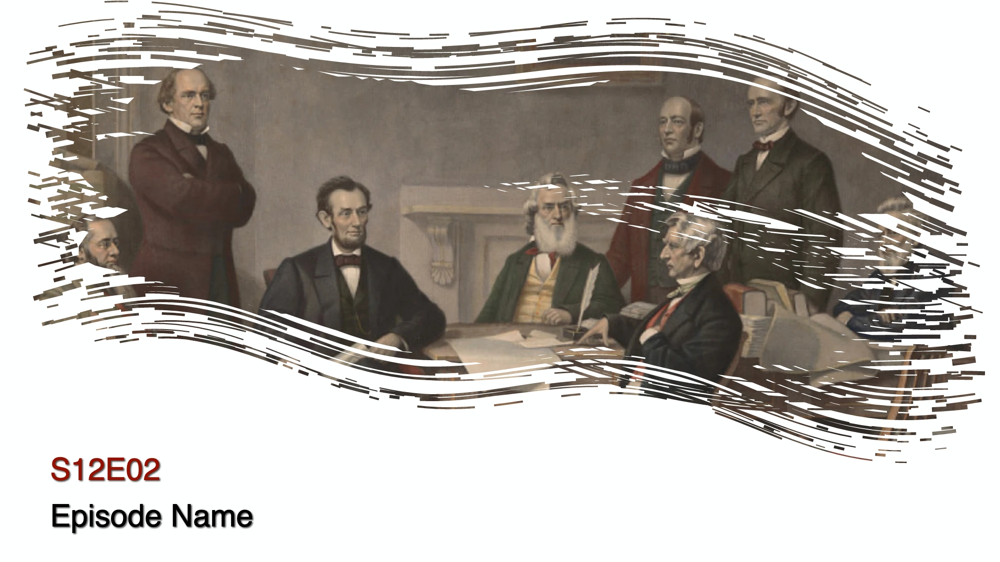 | 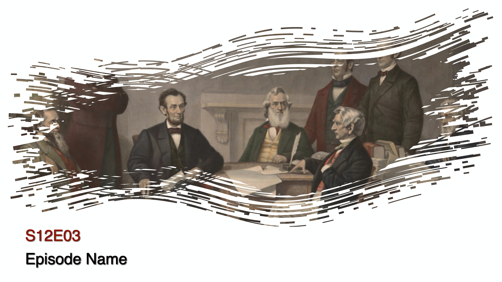 |

### Cutout Style  
Large episode numbers displayed as transparent cutouts revealing the screenshot beneath, with optional episode title.

| Example 1 | Example 2 | Example 3 |
|-----------|-----------|-----------|
| 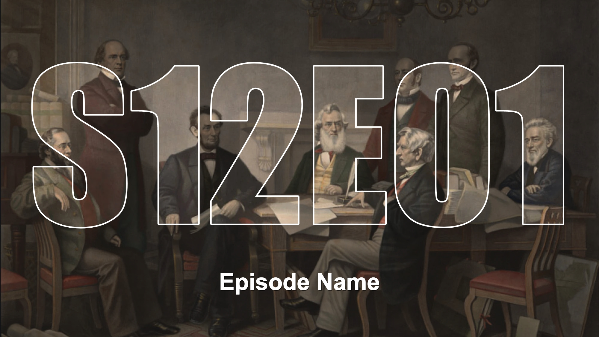 | 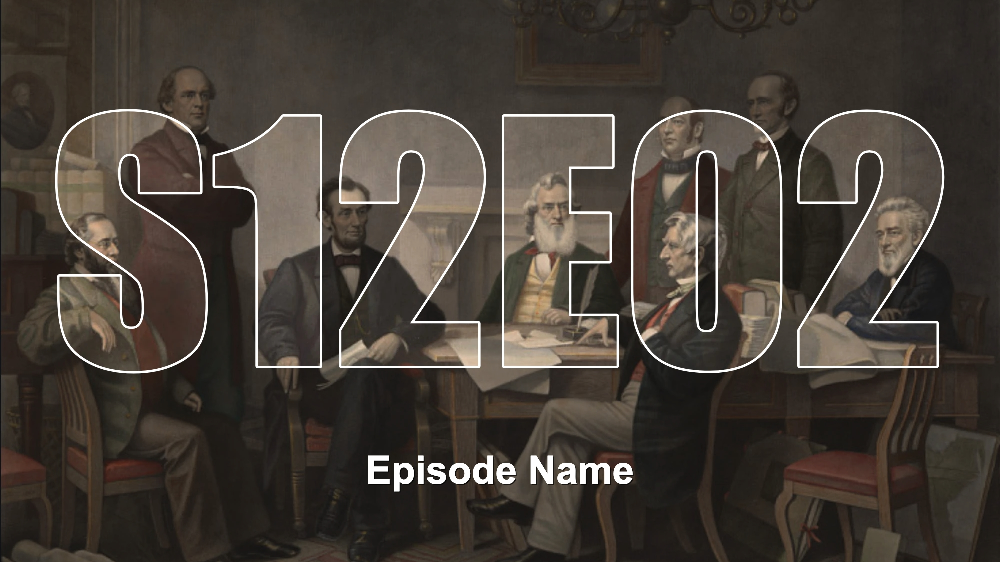 | 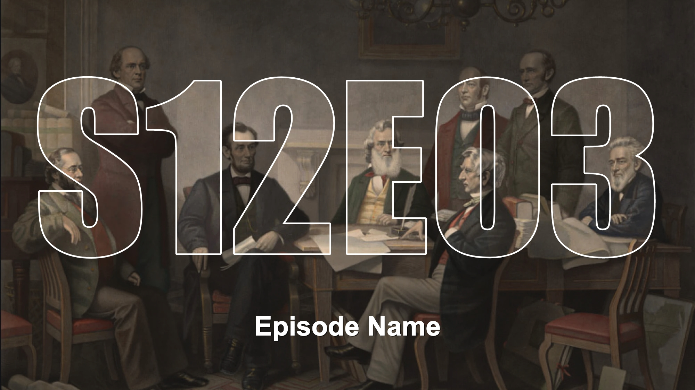 |

**Cutout Types:**
- **Code**: Displays episode in format "S01E03" 
- **Text**: Displays episode number as words (e.g., "THREE")

### Frame Style
Decorative frame borders with episode title and optional season/episode information.

| Example 1 | Example 2 | Example 3 |
|-----------|-----------|-----------|
|  | 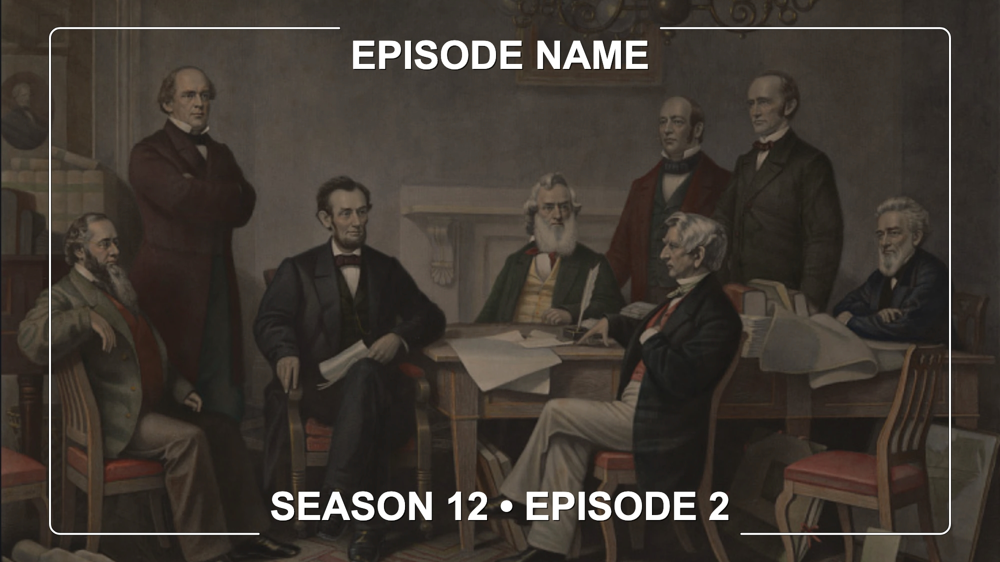 |  |

### Logo Style
Series logo-focused posters with optional season/episode information.

| Example 1 | Example 2 | Example 3 |
|-----------|-----------|-----------|
|  |  |  |

### Numeral Style
Roman numeral episode numbers with optional overlapping title.

| Example 1 | Example 2 | Example 3 |
|-----------|-----------|-----------|
| 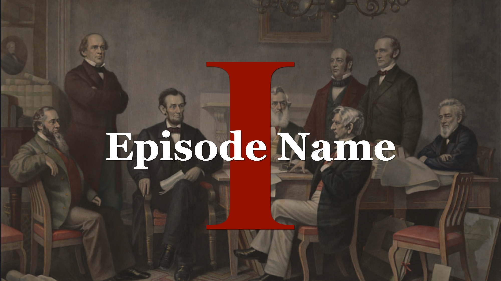 | 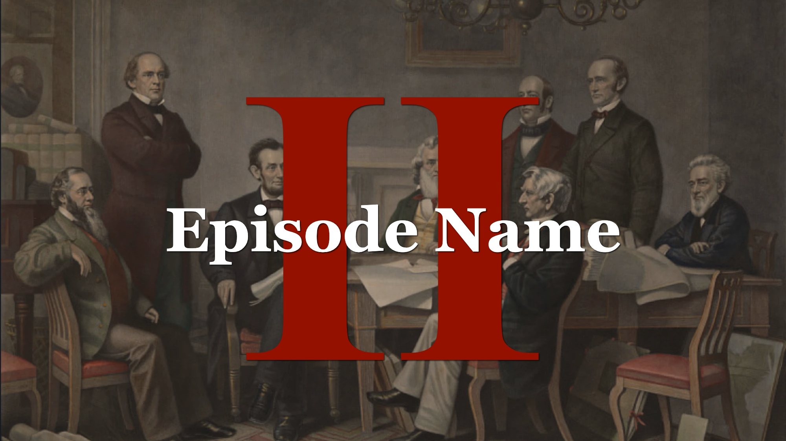 | 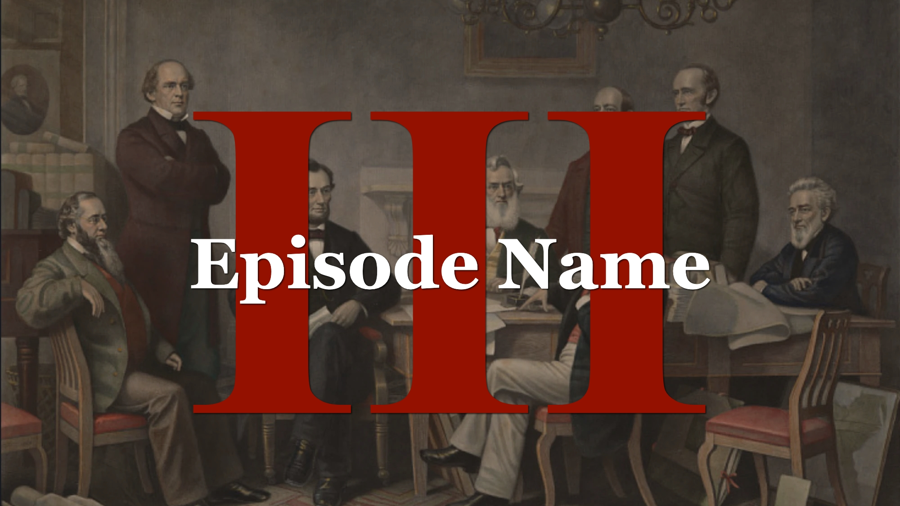 |

### Split Style
Episode screenshot with overlay text and episode information, split alongside the series poster.

| Example 1 | Example 2 | Example 3 |
|-----------|-----------|-----------|
|  |  | 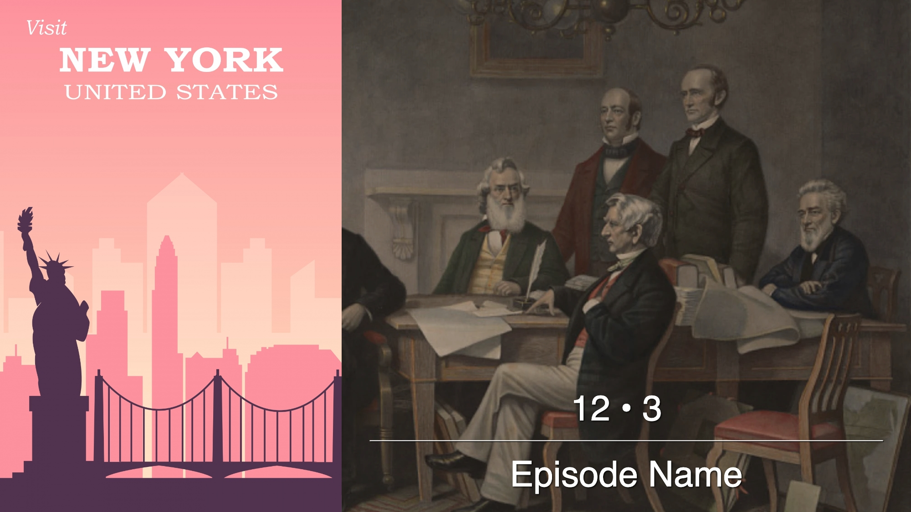 |

## Poster Architecture

The Episode Poster Generator uses a 4-layer rendering pipeline to create consistent posters across all styles:

### Layer 1: Canvas (Base Layer)
The foundation layer that provides the visual background for the poster.

**Options:**

- **Video Frame Extraction** -  Automatically extracts a frame from the episode video file using configurable extraction windows. Frames are selected at random until a suitable frame with adequate brightness and quality if found.
- **Transparent Background** - Creates a solid color or transparent canvas.

**Processing:**
- HDR brightening for HDR content
- Letterbox/pillarbox detection and cropping
- Aspect ratio adjustments and fill strategies

### Layer 2: Overlay (Color Tinting)
A semi-transparent color layer applied over the canvas to enhance text readability and create visual cohesion.

**Features:**
- Configurable ARGB hex colors with alpha transparency
- Applied uniformly across the entire poster surface or use two colors blurred together

### Layer 3: Graphics (Static Images)
Optional static graphic overlays positioned above the canvas but below text elements.

**Capabilities:**
- User-configurable file path for custom graphics
- Automatic sizing and positioning within safe area boundaries
- Supports PNG, JPG, and WEBP formats
- Maintains aspect ratio while fitting within poster constraints

### Layer 4: Typography (Text and Logos)
The top layer containing all text elements, episode information, and series logos.

**Elements:**
- Episode numbers and season information
- Episode titles with automatic text wrapping
- Series logos with configurable positioning
- Style-specific typography (Roman numerals, cutout text, etc.)
- Drop shadows and contrasting borders for enhanced readability

### Rendering Pipeline
Each poster style follows this exact 4-layer sequence. The modular approach allows for easy customization and additional poster styles.

## Usage & Documentation

### Settings
For an explanation of the settings, visit [SETTINGS.md](docs/SETTINGS.md).

### Template examples & downloads
For additional template examples and downloadable configurations, visit [EXAMPLES.md](docs/EXAMPLES.md).

### Preview your poster
When creating your poster, you can preview how this looks by selecting the `Preview` button at the top of the page.
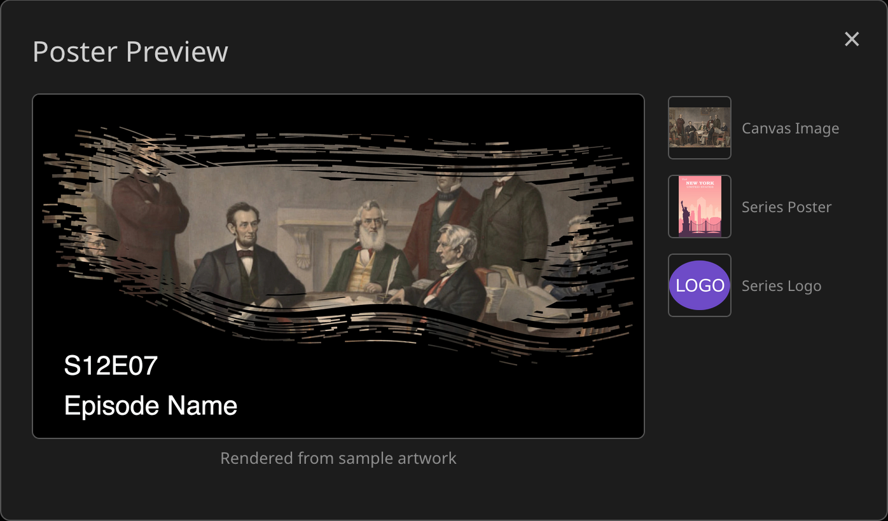

---

## Versioning

Releases use a four-part version, `JJ.JJ.F.B`, that matches the supported Jellyfin version with the plugin's own feature/bug count:

```
10.11.1.2
└───┘ └┬┘
  │    └── 1 = Plugin feature release
  │        2 = Plugin bug/patch release within that feature
  │
  └─── 10.11 = Jellyfin version this build was tested/released for
```

## Installation

### Step 1: Add Plugin Repository

* Open Jellyfin and navigate to Dashboard → Plugins → Repositories
* Click Add Repository
* Enter the following repository URL: `https://raw.githubusercontent.com/JPKribs/jellyfin-plugin-episodepostergenerator/master/manifest.json`
* Click Save

### Step 2: Install Plugin

* Go to the Catalog tab in the Plugins section
* Find Episode Poster Generator in the catalog
* Click Install
* Wait for installation to complete

### Step 3: Restart Jellyfin

* Restart your Jellyfin server completely
* Wait for Jellyfin to fully start up

### Verification Check

* After restart, navigate to Dashboard → Plugins → Episode Poster Generator to confirm the plugin configuration page loads properly.

---

## AI Disclaimer

Claude Code was utilized in the initial structure of this project and first drafts of documentation. All code has been manually reviewed, tested, and revised after its generation. This disclaimer exists in the interest of transparency.

**All code was written, or code reviewed and tested, by humans.**
